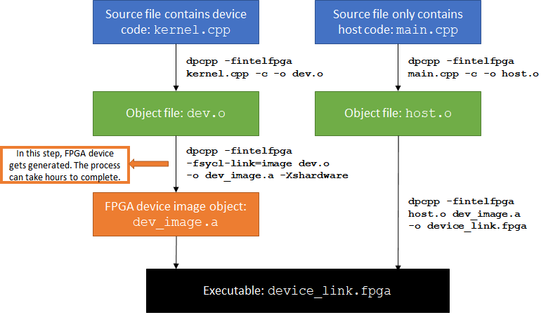

# OneAPI and Agilex Technical Setup

This guide details the process of setting up a development environment for Intel FPGAs using the oneAPI toolkit. Due to version incompatibilities between oneAPI and Quartus, the approach in this repo met several obstacles. The recommended approach is to use a Docker container to ensure a consistent and isolated environment. **See the new [FOOD](https://github.com/thomas-dsl-johnson/FOOD) repository**.

The legacy approach is included below for reference. It details the journey that led to the creation of the FOOD repository.

## Configuration-of-oneAPI-FPGA-Runtime-for-DE10-Agilex

```bash
# Installing Intel oneAPI Base Toolkit. Download the offline installer for Intel oneAPI Base Toolkit and execute it as follows:
# We get the 2025.2.0 version of Intel oneAPI Base Toolkit offline installer - Linux. I could not find a way to install any early versions.
cd /
sudo wget https://registrationcenter-download.intel.com/akdlm/IRC_NAS/bd1d0273-a931-4f7e-ab76-6a2a67d646c7/intel-oneapi-base-toolkit-2025.2.0.592_offline.sh
ls # Should see intel-oneapi-base-toolkit-2025.2.0.592_offline.sh

# Installing Intel FPGA Add-on for oneAPI Base Toolkit
# We get the FPGA support package offline installer - Linux
sudo wget https://registrationcenter-download.intel.com/akdlm/IRC_NAS/ff129224-aa19-48f7-96d4-ad12d2d427f9/intel-fpga-support-for-compiler-2025.0.0.591_offline.sh
ls # Should also now see intel-fpga-support-for-compiler-2025.0.0.591_offline.sh

# Make the offline installers executable
sudo chmod +x intel-oneapi-base-toolkit-2025.2.0.592_offline.sh
sudo chmod +x intel-fpga-support-for-compiler-2025.0.0.591_offline.sh

# Run the installers
sudo ./intel-oneapi-base-toolkit-2025.2.0.592_offline.sh
# "The following tools have been processed successfully: 
#  Intel® oneAPI Base Toolkit 2025.2
#  Download location: /root/intel"
sudo ./intel-fpga-support-for-compiler-2025.0.0.591_offline.sh
# "The following tools have been processed successfully:
#  FPGA Support Package for the Intel® oneAPI DPC++/C++ Compiler 2025.0.0
#  Download location: /root/intel"

# Clean up
sudo rm intel-fpga-support-for-compiler-2025.0.0.591_offline.sh
sudo rm intel-oneapi-base-toolkit-2025.2.0.592_offline.sh

# Installing Additional Libraries and Tools
# Some samples and build systems require development tools not included in the base toolkit. Install the following:
sudo apt update
sudo apt -y install cmake pkg-config build-essential libtinfo5 libncurses5

# Installing USB Blaster II Driver
# To enable the USB Blaster II device:
sudo nano /etc/udev/rules.d/51-usbblaster.rules
# Add the following lines:
#    # USB-Blaster
#    ENV{ID_BUS}=="usb", ENV{ID_VENDOR_ID}=="09fb", ENV{ID_MODEL_ID}=="6001", MODE="0666"
#    ENV{ID_BUS}=="usb", ENV{ID_VENDOR_ID}=="09fb", ENV{ID_MODEL_ID}=="6002", MODE="0666"
#    ENV{ID_BUS}=="usb", ENV{ID_VENDOR_ID}=="09fb", ENV{ID_MODEL_ID}=="6003", MODE="0666"
#    # USB-Blaster II
#    ENV{ID_BUS}=="usb", ENV{ID_VENDOR_ID}=="09fb", ENV{ID_MODEL_ID}=="6010", MODE="0666"
#    ENV{ID_BUS}=="usb", ENV{ID_VENDOR_ID}=="09fb", ENV{ID_MODEL_ID}=="6810", MODE="0666"
# Then reload udev rules or reboot.

# Do Quartus Install - You need to install Quartus 21.2 (not other versions)
# Previously, this was not necessary. Now we need to install it separately because of the divorce between Intel and Altera.
sudo wget 'https://downloads.intel.com/akdlm/software/acdsinst/21.2/72/ib_tar/Quartus-pro-21.2.0.72-linux-complete.tar'
# Extract
tar -xf Quartus-pro-21.2.0.72-linux-complete.tar
./setup_pro.sh 
export QUARTUS_ROOTDIR=/intelFPGA_pro/21.2/quartus/

# Installing the DE10-Agilex Board Support Package (BSP)
# Unzip the BSP and move it to the oneAPI board directory:
cd ~
wget https://download.terasic.com/downloads/cd-rom/de10-agilex/linux_BSP/DE10_Agilex_revC_linux_BSP_21.2.zip
unzip DE10_Agilex_revC_linux_BSP_21.2.zip
# Password: ###################### REDACTED ################################
rm DE10_Agilex_revC_linux_BSP_21.2.zip
sudo mkdir -p /opt/intel/oneapi/intelfpgadpcpp/latest/board/
sudo mv de10_agilex/ /opt/intel/oneapi/intelfpgadpcpp/latest/board/

# Setting up the Board and Environment
# Source the oneAPI environment:
cd intel/oneapi
chmod +x setvars.sh
source setvars.sh
cd /
# Add to ./bashrc file
echo 'source /opt/intel/oneapi/setvars.sh' >> ~/.bashrc

# Run the bring-up script:
cd /opt/intel/oneapi/intelfpgadpcpp/latest/board/de10_agilex/bringup/B2E2_8GBx4/
./bringup_fpga.sh fpga

# Verify PCIe device visibility:
lspci -d 1172: 
# 01:00.0 Processing accelerators: Altera Corporation Device 35b4 (rev 01)
export PATH=/intelFPGA_pro/21.2/hld/host/linux64/bin:$PATH
aocl diagnose
# No board support packages installed. This is not good

# Download vector add
oneapi-cli
mkdir build
cd build
cmake ..
make cpu-gpu
./vector-add-buffers
# Output:
# Running on device: AMD Ryzen 3 3200G with Radeon Vega Graphics
# Vector size: 10000
# [0]: 0 + 0 = 0
# [1]: 1 + 1 = 2
# [2]: 2 + 2 = 4
# ...
# [9999]: 9999 + 9999 = 19998
# Vector add successfully completed on device.
```

Upon opening a fresh terminal run the following:
```bash
export QUARTUS_ROOTDIR=/intelFPGA_pro/21.2/quartus/
export AOCL_BOARD_PACKAGE_ROOT=/opt/intel/oneapi/intelfpgadpcpp/latest/board/de10_agilex
export PATH=$QUARTUS_ROOTDIR/bin:$PATH
export LD_LIBRARY_PATH=$AOCL_BOARD_PACKAGE_ROOT/linux64/lib:$LD_LIBRARY_PATH
export PATH=/intelFPGA_pro/21.2/hld/host/linux64/bin:$PATH
aocl diagnose
aocl install
source /opt/intel/oneapi/intelfpgadpcpp/latest/board/de10_agilex/init_env.sh
cd /opt/intel/oneapi/intelfpgadpcpp/latest/board/de10_agilex/bringup/B2E2_8GBx4/
./bringup_fpga.sh fpga
export PATH=/intelFPGA_pro/21.2/hld/host/linux64/bin:$PATH
aocl diagnose
```

## Configuration of Docker Image of OneAPI 2022.1.2
Since Intel's acquisition of Altera, the FPGA development tools (Quartus, now under the Altera brand again) and the OneAPI software tools have been on increasingly separate development tracks. You cannot mix and match major versions and expect them to work. So, the plan now is to use Docker.

**What is it:** A Docker image is a self-contained package with a specific Linux OS, all the correct tool versions (Quartus, oneAPI, libraries), and pre-configured environment variables.

**Why is it useful:** It completely isolates the development environment from your host machine, eliminating any chance of version conflicts or incorrect setup.

On FPGA server:
```bash
# Since the FPGA server is down, this is a rough sketch
# 1. Install Docker
...
# 2. Pull the relevant image from Intel's Docker Hub.
docker pull intel/oneapi-basekit:2022.1.2-devel-ubuntu18.04
# The download is 5.6 Gb, it may take some time

# ... Proceed Similarly to `on local`
# Need to set --device flag on setup
```

On local (M1 MacBook):
```bash
# 1. Install Docker
# Download from https://www.docker.com/products/docker-desktop/
# Mount the .dmg

# 2. Pull the relevant image from Intel's Docker Hub. See https://hub.docker.com/r/intel/oneapi-basekit/tags?page=3
docker pull intel/oneapi-basekit:2022.1.2-devel-ubuntu18.04
# The download is 5.6 Gb, it may take some time

# 3. Set up directory
mkdir ~/docker_oneapi
cd ~/docker_oneapi

# 4. Create the container
docker run -it -v ~/oneapi_project:/host intel/oneapi-basekit:2022.1.2-devel-ubuntu18.04
# Open a new terminal and list containers
docker ps -a
# Copy CONTAINER ID of intel/oneapi-basekit:2022.1.2-devel-ubuntu18.04 e.g. abc123def456
# Create Image
docker commit abc123def456 my_oneapi_image
# Close container and run
docker run -it --name my_oneapi_dev -v ~/oneapi_project:/host my_oneapi_image
# In future
docker start -ai my_oneapi_dev
# n.b. If you ever want to get rid of it and start fresh
docker rm my_oneapi_dev
```

On Cloud VM:
```bash
# We are on Debian 6.1.140-1 (2025-05-22) x86_64

# 1. Install Docker Engine
# Following instructions on: 
# https://docs.docker.com/engine/install/debian/
sudo apt update
sudo apt install apt-transport-https ca-certificates curl software-properties-common
# Use the convenience script
curl -fsSL https://get.docker.com -o get-docker.sh
sudo sh get-docker.sh

# 2. Pull the relevant image from Intel's Docker Hub. See https://hub.docker.com/r/intel/oneapi-basekit/tags?page=3
sudo docker pull intel/oneapi-basekit:2022.1.2-devel-ubuntu18.04

# 3. Make dir
mkdir ~/oneapi_fpga_2022
cd oneapi_fpga_2022

# 4. Create the container
sudo docker run --name my_oneapi_2022 -it -v ~/oneapi_fpga_project:/host_project intel/oneapi-basekit:2022.1.2-devel-ubuntu18.04 /bin/bash
# In future
sudo docker start -ai my_oneapi_2022
```

Inside docker:
1. Set up
```bash
# Make sure you have run: sudo docker start -ai my_oneapi_2022

# 5. Install dependencies 
apt update 
apt upgrade
# Note sure how these work
apt-get install -y git wget unzip build-essential pkg-config cmake libtinfo5 libncurses5
apt install libtinfo6 libncurses6

# 6. Install Quartus
cd tmp
wget https://downloads.intel.com/akdlm/software/acdsinst/21.2/72/ib_tar/Quartus-pro-21.2.0.72-linux-complete.tar
tar -xf Quartus-pro-21.2.0.72-linux-complete.tar
./setup_pro.sh 
export QUARTUS_ROOTDIR=/intelFPGA_pro/21.2/quartus/

# 7.
# Get samples https://github.com/oneapi-src/oneAPI-samples/releases/tag/2022.1.0
apt-get update && apt-get install -y git
# Could not find vector add in the following: git clone -b 2022.1.0 https://github.com/oneapi-src/oneAPI-samples.git
# Vector add not compatible in the following: git clone -b 2023.1.0 https://github.com/oneapi-src/oneAPI-samples.git
git clone -b 2022.3.0 https://github.com/oneapi-src/oneAPI-samples.git
cd /tmp/oneAPI-samples/DirectProgramming/DPC++FPGA/Tutorials/GettingStarted/fpga_compile
```

2. Work through fpga_compile for FPGA emulator
This FPGA tutorial introduces how to compile SYCL*-compliant code for FPGA through a simple vector addition example.
We are following the steps outlined [here](https://github.com/oneapi-src/oneAPI-samples/tree/master/DirectProgramming/C%2B%2BSYCL_FPGA):
```bash
# Generate the `Makefile` by running `cmake`.
mkdir build
cd build
# To compile for the Intel® PAC with Intel Arria® 10 GX FPGA, run `cmake` using the command:
cmake ..
# Compile the design through the generated `Makefile`. The following build targets are provided, matching the recommended development flow.
# Compile for emulation (compiles quickly, targets emulated FPGA device)
make fpga_emu
# For other options see the README.md file in assets
# If an error occurs, you can get more details by running `make` with the `VERBOSE=1` argument:
# (optional) make VERBOSE=1
# Run the sample on the FPGA emulator (the kernel executes on the CPU):
./fpga_compile.fpga_emu
## Running on device: Intel(R) FPGA Emulation Device
## PASSED: results are correct
```

3. Work through fpga_recompile for FPGA emulator
This FPGA tutorial demonstrates how to separate the compilation of a program's host code and device code to save development time.
Learning points:
* Why to separate host and device code compilation in your FPGA project 
* How to use the -reuse-exe and device link methods 
* Which method to choose for your project

Intel® oneAPI DPC++ Compiler only supports ahead-of-time (AoT) compilation for FPGA, which means that an FPGA device image is generated at compile time. The FPGA device image generation process can take hours to complete. Suppose you make a change that is exclusive to the host code. In that case, it is more efficient to recompile your host code only, re-using the existing FPGA device image and circumventing the time-consuming device compilation process.

The compiler provides two different mechanisms to separate device code and host code compilation.

**Method 1**
Passing the -reuse-exe=<exe_name> flag to dpcpp instructs the compiler to attempt to reuse the existing FPGA device image.
The more explicit "device link" method requires you to separate the host and device code into separate files. When a code change only applies to host-only files, an FPGA device image is not regenerated.
If the device code and options affecting the device have not changed since the previous compilation, passing the -reuse-exe=<exe_name> flag to dpcpp instructs the compiler to extract the compiled FPGA binary from the existing executable and package it into the new executable, saving the device compilation time.
1. Initial compilation
dpcpp <files.cpp> -o out.fpga -Xshardware -fintelfpga
The initial compilation generates an FPGA device image, which takes several hours. Now, make some changes to the host code.
2. Subsequent recompilation
dpcpp <files.cpp> -o out.fpga -reuse-exe=out.fpga -Xshardware -fintelfpga

**Method 2**
If you want to iterate on the host code and avoid long compile time for your FPGA device, consider using a device link to separate device and host compilation:
1. Compile the device code:
   Input files should include all source files that contain device code. This step may take several hours.
2. Compile the host code:
   dpcpp -fintelfpga host.cpp -c -o host.o
   Input files should include all source files that only contain host code. This takes seconds. 
3. Create the device link:
   dpcpp -fintelfpga host.o dev_image.a -o fast_recompile.fpga
   The input should have N (N >= 0) host object files *(.o)* and one device image file *(.a)*. This takes seconds.
   You only need to perform steps 2 and 3 when modifying host-only files. 
   The following graph depicts the device link compilation process:


**Conclusion**
Of the two methods described, `-reuse-exe` is easier to use. It also allows you to keep your host and device code as single source, which is preferred for small programs.

For larger and more complex projects, the device link method has the advantage of giving you complete control over the compiler's behavior.
* When using `-reuse-exe`, the compiler must partially recompile and then analyze the device code to ensure that it is unchanged. This takes several minutes for larger designs. Compiling separate files does not incur this extra time.
* When using `-reuse-exe`, you may occasionally encounter a "false positive" where the compiler wrongly believes that it must recompile your device code. In a single source file, the device and host code are coupled, so some changes to the host code _can_ change the compiler's view of the device code. The compiler will always behave conservatively and trigger a full recompilation if it cannot prove that reusing the previous FPGA binary is safe. Compiling separate files eliminates this possibility.

Running the sample:
```bash
mkdir build
cd build
cmake ..
# Compile for emulation (fast compile time, targets emulated FPGA device)
make fpga_emu
./fast_recompile.fpga_emu 
# PASSED: results are correct
```

## Configuration of Docker Image of OneAPI using version 2025.0

We shall proceed similarly to the 2022 version.

On Cloud VM:
```bash
# https://hub.docker.com/r/intel/oneapi-basekit/tags?page=3
# 1. Install Docker Engine (if not already installed)
# Following instructions on: 
# https://docs.docker.com/engine/install/debian/
sudo apt update
sudo apt install apt-transport-https ca-certificates curl software-properties-common
# Use the convenience script
curl -fsSL https://get.docker.com -o get-docker.sh
sudo sh get-docker.sh

# 2. Pull the relevant image from Intel's Docker Hub. See https://hub.docker.com/r/intel/oneapi-basekit/tags?page=3
sudo docker pull intel/oneapi-basekit:2025.0.2-0-devel-ubuntu24.04

# 3. Make dir
mkdir ~/oneapi_fpga_2025
cd oneapi_fpga_2025

# 4. Create the container
sudo docker run --name my_oneapi_2025 -it -v ~/oneapi_fpga_2025:/host_project intel/oneapi-basekit:2025.0.2-0-devel-ubuntu24.04 /bin/bash
# In future
sudo docker start -ai my_oneapi_2025
# To restart
sudo docker rm my_oneapi_2025
```

Inside docker:
1. Set up
```bash
# Make sure you have run: sudo docker start -ai my_oneapi_2025

# 5. Install dependencies
apt-get update && apt-get install -y git wget unzip build-essential pkg-config cmake libtinfo5 libncurses5

# 6. Clone examples
# Note: This is the master branch: https://github.com/oneapi-src/oneAPI-samples/tree/master/
git clone -b master https://github.com/oneapi-src/oneAPI-samples.git
cd oneAPI-samples
```
2. Vector Add Sample
 
A Hello, World! sample for data parallel programs, so the sample code demonstrates some core features of SYCL*. Additionally, building and running this sample verifies that the development environment is configured correctly for Intel® oneAPI Toolkits.
```bash
# 7. example1: vector-add
cd oneAPI-samples/DirectProgramming/C++SYCL/DenseLinearAlgebra/vector-add/

# Generate the `Makefile` by running `cmake`.
mkdir build
cd build
cmake ..
make cpu-gpu
#Running on device: AMD EPYC 7B12
#Vector size: 10000
#[0]: 0 + 0 = 0
#[1]: 1 + 1 = 2
#[2]: 2 + 2 = 4
#...
#[9999]: 9999 + 9999 = 19998
#Vector add successfully completed on device.

#  FPGA Support Package for the Intel ® oneAPI DPC++/C++ Compile attempt I
cd /tmp
wget https://registrationcenter-download.intel.com/akdlm/IRC_NAS/ff129224-aa19-48f7-96d4-ad12d2d427f9/intel-fpga-support-for-compiler-2025.0.0.591_offline.sh
chmod +x intel-fpga-support-for-compiler-2025.0.0.591_offline.sh
./intel-fpga-support-for-compiler-2025.0.0.591_offline.sh
source /opt/intel/oneapi/setvars.sh
https://www.intel.com/content/www/us/en/docs/oneapi-fpga-add-on/developer-guide/2025-0/installing-the-intel-oneapi-fpga-development.html


#  FPGA Support Package for the Intel ® oneAPI DPC++/C++ Compile attempt II
apt install intel-oneapi-compiler-fpga-2025.0

cd oneAPI-samples/DirectProgramming/C++SYCL/DenseLinearAlgebra/vector-add/
make clean

make fpga_emu
./vector-add-buffers.fpga_emu
#Running on device: Intel(R) FPGA Emulation Device
#Vector size: 10000
#[0]: 0 + 0 = 0
#[1]: 1 + 1 = 2
#[2]: 2 + 2 = 4
#...
#[9999]: 9999 + 9999 = 19998
#Vector add successfully completed on device.

# make fpga_sim
# Currently the make fpga_sim is not supported 
# since currently we do not have Questa simulator on our machine.

# Quartus we need a newer version - the 23.3 version
wget -c https://downloads.intel.com/akdlm/software/acdsinst/23.3/104/ib_tar/Quartus-pro-23.3.0.104-linux-complete.tar
tar -xf Quartus-pro-23.3.0.104-linux-complete.tar
./setup_pro.sh 

export QUARTUS_ROOTDIR=/root/intelFPGA_pro/23.3/quartus
export QUARTUS_ROOTDIR_OVERRIDE=/root/intelFPGA_pro/23.3/quartus

make fpga
```

### Useful Information

#### Three types of SYCL for FPGA compilation
The three types of FPGA compilation are summarized in the table below.

| Device Image Type    | Time to Compile | Description
---                    |---              |---
| FPGA Emulator        | seconds         | The FPGA device code is compiled to the CPU. <br> This is used to verify the code's functional correctness.
| Optimization Report  | minutes         | The FPGA device code is partially compiled for hardware. <br> The compiler generates an optimization report that describes the structures generated on the FPGA, identifies performance bottlenecks, and estimates resource utilization.
| FPGA Hardware        | hours           | Generates the real FPGA bitstream to execute on the target FPGA platform


| We also have
| Compilation Type    | Command
| FPGA Emulator       | make fpga_emu
| Optimization Report | make report
| FPGA Simulator      | make fpga_sim
| FPGA Hardware       | make fpga

The typical FPGA development workflow is to iterate in each of these stages, refining the code using the feedback provided by that stage. Intel® recommends relying on emulation and the optimization report whenever possible.

#### Important caveats to remember when using the FPGA emulator.
*  **Performance is not representative.** _Never_ draw inferences about FPGA performance from the FPGA emulator. The FPGA emulator's timing behavior is uncorrelated to that of the physical FPGA hardware. For example, an optimization that yields a 100x performance improvement on the FPGA may show no impact on the emulator performance. It may show an unrelated increase or even a decrease.
* **Undefined behavior may differ.** If your code produces different results when compiled for the FPGA emulator versus FPGA hardware, your code most likely exercises undefined behavior. By definition, undefined behavior is not specified by the language specification and may manifest differently on different targets.

#### Device Selection
See the README.md in `assets/`

#### Additional Documentation
- [Explore SYCL* Through Intel&reg; FPGA Code Samples](https://software.intel.com/content/www/us/en/develop/articles/explore-dpcpp-through-intel-fpga-code-samples.html) helps you to navigate the samples and build your knowledge of FPGAs and SYCL.
- [FPGA Optimization Guide for Intel&reg; oneAPI Toolkits](https://software.intel.com/content/www/us/en/develop/documentation/oneapi-fpga-optimization-guide) helps you understand how to target FPGAs using SYCL and Intel&reg; oneAPI Toolkits.
- [Intel&reg; oneAPI Programming Guide](https://software.intel.com/en-us/oneapi-programming-guide) helps you understand target-independent, SYCL-compliant programming using Intel&reg; oneAPI Toolkits.


